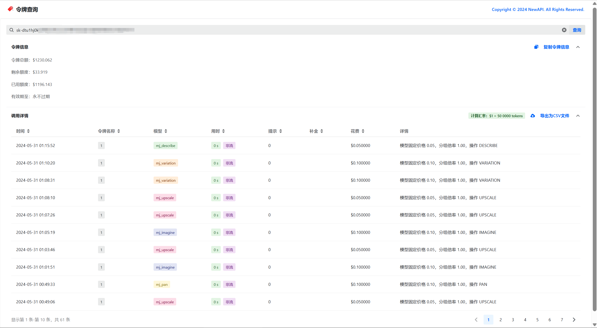

> 该项目需配合 NewAPI 才能正常使用：<https://github.com/Calcium-Ion/new-api>

<div align="center">
  <h1 align="center">FishXCode API Key Tool</h1>
  <p align="center">基于 NewAPI 的令牌额度与调用日志查询页</p>
</div>



## 项目简介

这是一个基于 React + Semi UI 的 NewAPI 令牌查询前端，适合部署为独立查询页或嵌入现有站点。

当前版本支持：

- 查询令牌额度、剩余额度、已用额度与有效期
- 查询调用日志、模型汇总、请求摘要与计费参数
- 展示缓存读 / 缓存写 / 5m 创建 / 1h 创建相关信息
- 支持多 NewAPI 站点聚合查询
- 支持 `?key=` / `?site=` 直达查询
- 支持桌面端表格视图与移动端卡片视图
- 支持 CSV 导出与基础 SEO

## 环境变量

```bash
# 是否展示令牌额度信息
REACT_APP_SHOW_BALANCE=true

# 是否展示调用详情
REACT_APP_SHOW_DETAIL=true

# NewAPI 的 Base URL
# 支持多个站点聚合查询，键为站点名称，值为站点 URL
REACT_APP_BASE_URL={"main":"https://api-key-tool.fishxcode.com","www":"https://www.fishxcode.com"}

# 是否展示 GitHub 图标
REACT_APP_SHOW_ICONGITHUB=true

# 站点对外 URL，用于 canonical / OG / sitemap
REACT_APP_SITE_URL=https://api-key-tool.fishxcode.com
```

## 本地开发

```bash
npm install
cp .env.example .env
npm start
```

默认开发地址：

```bash
http://localhost:3000
```

支持直达查询：

```bash
http://localhost:3000/?key=sk-xxxxxxxxxxxxxxxxxxxxxxxxxxxxxxxxxxxxxxxxxxxxxxxx
http://localhost:3000/?key=sk-xxxxxxxxxxxxxxxxxxxxxxxxxxxxxxxxxxxxxxxxxxxxxxxx&site=server1
```

## 部署方式

### Vercel

1. 准备好你的 NewAPI 服务。
2. 导入当前仓库到 Vercel。
3. 配置上面的环境变量。
4. 完成部署后即可使用。
5. 如有需要，绑定自定义域名。

### Docker

```bash
git clone git@github.com:fishxcode/api-key-tool.git
cd api-key-tool
cp .env.example .env
docker build -t fishxcode-api-key-tool .
docker run -d -p 80:80 --name fishxcode-api-key-tool fishxcode-api-key-tool
```

## 页面能力说明

### 查询页

- 支持输入令牌后实时查询
- 支持按模型、请求摘要、流式类型筛选
- 支持模型维度聚合统计
- 支持缓存相关字段展示

### 移动端

- 移动端使用卡片化日志布局
- 支持独立分页
- 支持返回顶部

## 二次开发

复制 `.env.example` 为 `.env` 后，根据你的 NewAPI 地址与展示需求调整配置即可。

常用命令：

```bash
npm start
npm run build
```

## 版权与来源

本项目基于原始项目 **Calcium-Ion / neko-api-key-tool** 继续开发与定制，保留原项目版权与来源信息。

- 原项目地址：<https://github.com/Calcium-Ion/neko-api-key-tool>
- 依赖后端：<https://github.com/Calcium-Ion/new-api>

如果你在分发、二次修改或商业使用时需要进一步明确许可证，请同时查阅原项目仓库中的许可证与版权声明。
